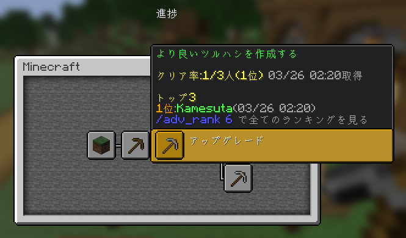
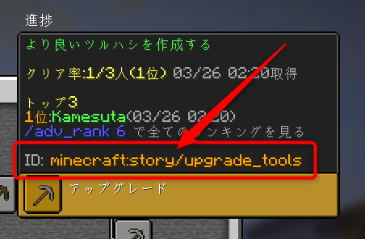
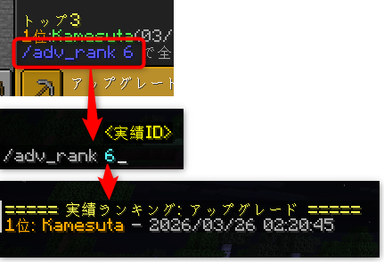

# AdvancementRanking

AdvancementRanking は、Minecraft の実績画面にランキング情報を追加し、他プレイヤーの進捗閲覧や実績別ランキング表示を行える Paper 向けプラグインです。  
ProtocolLib で進捗パケットを書き換え、通常の実績 UI を活かしたまま情報を拡張します。

## 主な機能

- 実績画面にトップ3と直近達成者を表示
- 実績ごとの詳細ランキングを `/adv_rank` で表示
- `/adv` で他プレイヤーの実績画面を表示
- `/adv_id` で実績キーを確認
- SQLite / MySQL に対応
- 既存の `world/advancements/*.json` から実績データをインポート可能

## 対応環境

- Minecraft: `1.21.7` ベースでビルド
- サーバー: Paper / Paper 互換サーバー
- Java: `21`
- 必須依存: [ProtocolLib](https://modrinth.com/plugin/protocollib)

NMSリフレクションを利用しているため、対応バージョン以外では動作しない可能性があります。

## できること

### 1. 実績画面にランキングを追加

実績画面を開くと、各実績の説明文に以下の情報が追加されます。

- トップ3
- 直近達成3位
- 達成者数
- 詳細ランキングを開くための `/adv_rank <ID>` コマンド



`config.yml` の `disable_top3: true` を有効にすると、トップ3表示を無効化して直近達成表示のみ使えます。

### 2. 他プレイヤーの進捗を見る

`/adv <player>` を実行すると、指定プレイヤーの進捗を自分の実績画面で確認できます。  
PvP やイベントサーバーで、進行度の比較を行いたい場合に向いています。

### 3. 実績 ID を確認する

`/adv_id` を実行すると、実績画面の説明欄に実績キーが表示されます。  
ランキング対象の確認や管理用途に便利です。



### 4. 詳細ランキングを表示する

`/adv_rank <ID> [ページ]` で、指定実績の達成順位をチャットに表示します。

- 1ページ 10 件表示
- ページネーション対応
- 実行者自身の順位を強調表示
- 実績名は可能な限りゲーム内翻訳名で表示



## インストール

1. サーバーに ProtocolLib を導入します。
2. `AdvancementRanking-x.x.x.jar` を `plugins` フォルダに配置します。
3. サーバーを起動して設定ファイルを生成します。
4. 必要に応じて `plugins/AdvancementRanking/config.yml` を編集します。
5. サーバーを再起動、またはリロード相当の運用手順で反映します。

## 設定

デフォルト設定:

```yml
database:
  type: "sqlite" # sqlite or mysql

mysql:
  username: "root"
  password: ""
  databaseName: "advancement_ranking"
  host: "127.0.0.1"
  port: 3306

disable_top3: false
```

### データベース

- `sqlite`: 手軽に使いたい小規模サーバー向け
- `mysql`: 複数ワールド運用や永続管理を重視するサーバー向け

`database.type` を `mysql` にした場合のみ、`mysql` セクションが使われます。

## コマンド

| コマンド | 説明 | 権限 |
| --- | --- | --- |
| `/adv <player>` | 他プレイヤーの進捗を表示 | `advrank.command.adv` |
| `/adv_id` | 実績キー表示モードを有効化 | `advrank.command.adv_id` |
| `/adv_rank <ID> [ページ]` | 実績別ランキングを表示 | `advrank.command.adv_rank` |
| `/adv_admin import_json_to_db` | `world/advancements` の JSON を DB に取り込む | `advrank.admin` |

## 権限

| 権限 | 説明 | デフォルト |
| --- | --- | --- |
| `advrank.admin` | 管理者コマンドを使用可能 | OP |
| `advrank.command.adv` | `/adv` を使用可能 | true |
| `advrank.command.adv_id` | `/adv_id` を使用可能 | true |
| `advrank.command.adv_rank` | `/adv_rank` を使用可能 | true |

## 既存データのインポート

既存ワールドの実績 JSON をデータベースへ登録したい場合は、管理者権限で以下を実行します。

```text
/adv_admin import_json_to_db
```

このコマンドは `world/advancements/*.json` を走査し、達成済み実績をデータベースへ登録します。

用途:

- すでに進行しているサーバーへ後から導入する
- ワールド移行後にランキング用データを再構築する

## 注意事項

- ProtocolLib がないと起動できません
- 実績画面のパケットを書き換えるため、クライアント表示に依存するプラグインと競合する可能性があります
- NMS を利用しているため、Minecraft バージョン更新時は再ビルドや追従が必要になる場合があります

## ビルド

```bash
mvn clean package
```

ビルド済み jar は `target/` に出力されます。
